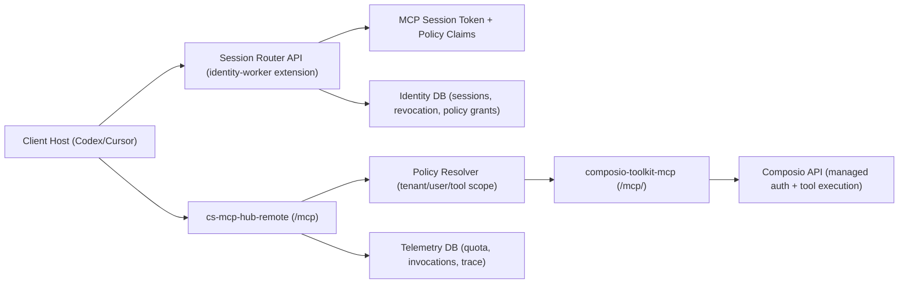
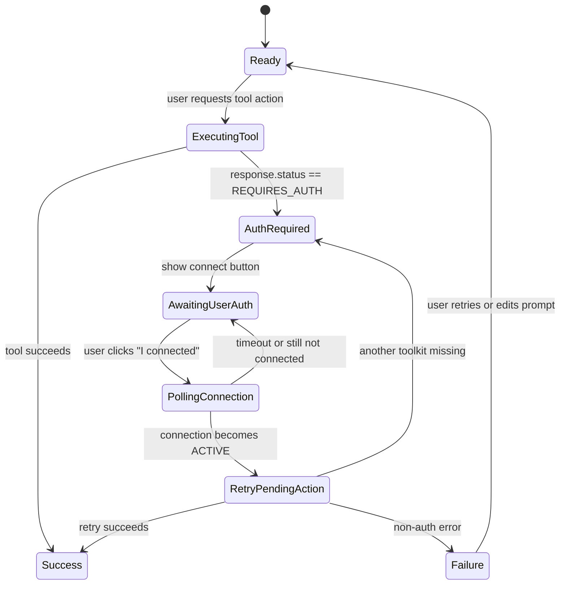

# Composio Multi-Tenant Hub Migration Plan (2026-02-26)

## Goal

Move from client-specific MCP instances to a multi-tenant MCP hub model without breaking current client operations.

Success criteria:

1. One primary MCP endpoint for hosts (Codex, Cursor, Windsurf) with tenant and user isolation.
2. Auth and tool access controlled by policy (`tenant_id`, `user_id`, allowed toolkits/tools).
3. Existing single-instance clients can be migrated incrementally with dual-run safety.
4. "Auth required" becomes a first-class UI flow, not a backend-only error.

## Current Baseline In This Repo

### Already in place

1. Hub gateway runtime:
   - `packages/cs-mcp-hub-remote/index.ts`
   - Per-request account forwarding via `x-mcp-account-id` and `x-hub-account-id`
   - Built-in rate limits and quotas
2. Toolkit-scoped Composio gateway:
   - `packages/composio-toolkit-mcp/index.ts`
   - Management tools: `connection_status`, `get_connect_link`, `toolkit_info`
3. Composio wrap pattern:
   - `packages/composio-bridge/src/*`
   - `ComposioToolFactory`, `ComposioAuthProvider`, `ComposioClient`
4. Registry + routing control plane:
   - `config/mcp-hub/registry.json` (984 composio toolkit routes)
   - `config/mcp-hub/routing.json` (tenant routing scaffold exists)

### Current gaps

1. Session identity is not yet a dedicated minted contract; hub can currently fall back to bearer-as-account-id.
2. Tenant policy is not dynamically bound to authenticated session claims in remote hub.
3. Auth-required UX contract is not standardized across all client-facing flows.
4. Single-tenant deployment footprint still exists (for example multiple `wrangler.*.toml` files in `packages/halfdozen-notion-mcp/worker/`).

## Target Architecture



Design intent:

1. Session Router is the identity boundary.
2. Hub is the policy and routing boundary.
3. Composio is integration plumbing (not client-facing product surface).

## Deployment Decision (Cloudflare)

## Decision

Use a hybrid model:

1. Default: Worker-based edge gateway (`cs-mcp-hub-remote` + `composio-toolkit-mcp`).
2. Exception: Cloudflare Tunnel + container for private network connectors that require VPC/on-prem reach.

## Why

1. Edge hub gives low-latency global MCP transport and simpler SaaS scale.
2. Tunnel path preserves private data-plane constraints for regulated clients.
3. Both can share the same session-router and policy model.

## Phase Plan

## Phase 0 - Baseline and Inventory (3-5 days)

Deliverables:

1. Tenant map: current single-instance clients to target tenant IDs.
2. Toolkit policy matrix: allowed toolkits and read/write profile per tenant.
3. Baseline telemetry dashboards for:
   - account isolation
   - auth-required frequency
   - tool error rates by tenant/toolkit

Repo touchpoints:

1. `config/mcp-hub/routing.json` (expand tenants and policy)
2. `evals/langfuse/mcp/account-isolation.eval.ts` (baseline run)
3. `docs/HUB_COMPOSIO_READINESS_ASSESSMENT_2026-02-21.md` (link updated baseline)

## Phase 1 - Session Router Foundation (1-2 weeks)

Objective:

Issue short-lived MCP session tokens that encode tenant/user policy and are revocable.

Implementation target:

1. Extend `packages/identity-worker` with MCP session endpoints.
2. Add D1 tables:
   - `mcp_sessions`
   - `mcp_session_scopes`
   - `mcp_auth_events`
3. Add internal resolve endpoint for hub runtime validation.

Contract:

1. `POST /v1/mcp/sessions` (create session)
2. `POST /v1/mcp/sessions/resolve` (hub-only token introspection)
3. `POST /v1/mcp/sessions/:id/revoke`
4. `GET /v1/mcp/sessions/:id`

## Phase 2 - Hub Identity and Policy Enforcement (1-2 weeks)

Objective:

Make `cs-mcp-hub-remote` policy decisions session-driven instead of header/bearer fallback.

Implementation target:

1. Token introspection call to identity worker on each request (cache short TTL).
2. Replace account fallback resolution with:
   - `tenant_id`
   - `account_id` (opaque stable ID)
   - allowed tool prefixes / toolkit scopes
3. Enforce route filtering before proxied tool execution.
4. Keep existing rate limit/quota controls and bind to resolved account ID.

Repo touchpoints:

1. `packages/cs-mcp-hub-remote/index.ts`
2. `config/mcp-hub/routing.json` (tenant policies)
3. `docs/MCP_HUB_REMOTE_DEPLOY.md` (auth and header requirements update)

## Phase 3 - Auth Required UX Contract (1 week)

Objective:

Standardize client UX for "tool not authenticated" responses.

Implementation target:

1. Normalized response envelope in toolkit routes and bridge wrappers:
   - `status: "REQUIRES_AUTH"`
   - `toolkit`
   - `auth_link`
   - `session_id`
2. Add retry helper endpoint or contract to resume last failed action.
3. UI component/state machine used across portals/hosts.

Repo touchpoints:

1. `packages/composio-toolkit-mcp/index.ts`
2. `packages/composio-bridge/src/client.ts`
3. Client UI package that owns MCP onboarding surfaces

## Phase 4 - Dual Run and Cohort Migration (2-4 weeks)

Objective:

Migrate current single-instance tenants in cohorts, with rollback per cohort.

Cohort approach:

1. Cohort A: low-risk internal or read-mostly tenants.
2. Cohort B: medium-risk production tenants.
3. Cohort C: high-risk or private-network tenants (tunnel path where needed).

Cutover gates per cohort:

1. Account isolation eval pass.
2. Auth-required flow pass.
3. Error/latency SLOs within threshold for 7 days.

## Phase 5 - Decommission and Hardening (1 week)

Objective:

Retire redundant single-instance deployment configs after stable hub adoption.

Tasks:

1. Remove no-longer-used per-client wrangler variants.
2. Keep migration mapping doc for audit trail.
3. Lock policy defaults in routing config and deployment docs.

## Backend Session Router Contract (Proposed)

## 1) Create session

`POST /v1/mcp/sessions`

Request:

```json
{
  "tenant_id": "halfdozen",
  "user_id": "usr_123",
  "host": "codex",
  "toolkit_profile": ["gmail", "slack", "notion"],
  "tool_mode": "read_write"
}
```

Response:

```json
{
  "session_id": "ms_01J...",
  "token": "ms_tok_...",
  "mcp_url": "https://cs-mcp-hub-remote.<subdomain>.workers.dev/mcp",
  "expires_at": "2026-02-26T18:15:00Z",
  "account_id": "acct_opaque_...",
  "tenant_id": "halfdozen",
  "allowed_tool_prefixes": ["composio-toolkit-gmail__", "composio-toolkit-slack__", "composio-toolkit-notion__"],
  "required_auth": [
    {
      "toolkit": "slack",
      "connected": false,
      "connect_link": "https://..."
    }
  ]
}
```

## 2) Resolve session (hub internal)

`POST /v1/mcp/sessions/resolve`

Request:

```json
{
  "token": "ms_tok_..."
}
```

Response:

```json
{
  "valid": true,
  "session_id": "ms_01J...",
  "account_id": "acct_opaque_...",
  "tenant_id": "halfdozen",
  "user_id": "usr_123",
  "expires_at": "2026-02-26T18:15:00Z",
  "allowed_tool_prefixes": ["composio-toolkit-gmail__", "composio-toolkit-slack__"],
  "allow_pending_oauth_approvals": false
}
```

## 3) Revoke session

`POST /v1/mcp/sessions/:id/revoke`

Effect:

1. Session invalid immediately.
2. Hub rejects subsequent calls with `401/403`.

## Auth Required UI State Machine



UX rules:

1. Never drop user intent; retain and replay last tool call after auth.
2. Show provider-specific CTA label ("Connect Slack", "Connect Notion").
3. Include timeout and "open auth link again" actions.

## Work Breakdown By Package

1. `packages/identity-worker`
   - Add MCP session schema + endpoints + revocation + token introspection
2. `packages/cs-mcp-hub-remote`
   - Replace account fallback with session-introspection-based identity
   - Apply per-session tool scope filtering before route execution
3. `packages/composio-toolkit-mcp`
   - Normalize auth-required response payload
4. `packages/composio-bridge`
   - Normalize auth-related execution errors into consistent shape
5. `config/mcp-hub/routing.json`
   - Define tenant policies and allowed tool prefixes
6. `docs/*`
   - Update deploy/runbook and migration status docs

## Verification Gates

Before each cohort cutover:

1. `pnpm check`
2. `pnpm lint`
3. `pnpm test`
4. `pnpm langfuse:eval:mcp:account-isolation`
5. Manual runbook:
   - session issue
   - auth-required flow
   - token revoke
   - tenant isolation check across two accounts

## Risks and Mitigations

1. Risk: token leakage in host config
   - Mitigation: short TTL, revocation endpoint, scoped token claims, no raw user IDs in token payload
2. Risk: auth redirect breakage in embedded hosts
   - Mitigation: explicit redirect URLs and popup/new-tab fallback behavior
3. Risk: route overexposure by default
   - Mitigation: deny-by-default tenant policy, explicit allow prefixes
4. Risk: migration regressions for existing single instances
   - Mitigation: dual-run per cohort with rollback for 7-day observation window

## Immediate Next Execution Step

Implement Phase 1 first in `packages/identity-worker` and wire a minimal resolver in `packages/cs-mcp-hub-remote`, then run account-isolation eval before any client cutover.
