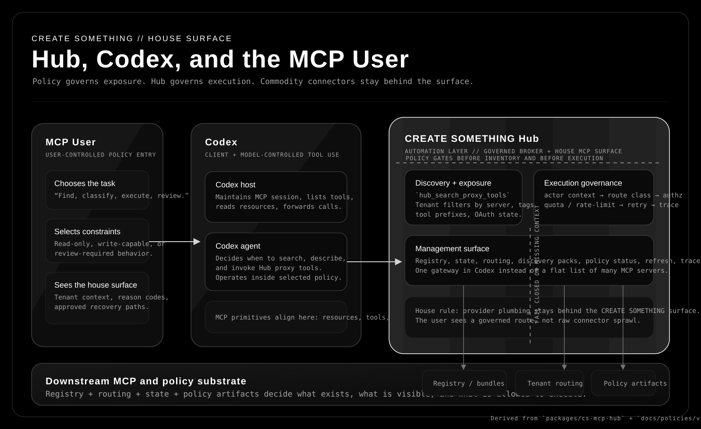

# Hub, Codex, and the MCP User

This visualization frames the Hub as the CREATE SOMETHING house surface inside Codex:

- the **MCP user** selects intent and operating constraints
- **Codex** hosts the session while the **Codex agent** chooses when to invoke tools
- the **Hub** constrains visibility, routing, and downstream execution
- downstream MCP servers, registry state, and policy artifacts form the substrate behind the surface

## Brand alignment

The diagram follows CREATE SOMETHING canon rather than generic platform-diagram styling:

- monochrome palette from the repo's Canon tokens
- typographic hierarchy over decorative color
- hard boundary between the house surface and provider plumbing
- minimal labels that emphasize governance, not connector branding

## Code and policy anchors

The visualization is grounded in these implementation surfaces:

- Hub management and proxy runtime: `packages/cs-mcp-hub/src/index.ts`
- Registry, state, and Codex config handling: `packages/cs-mcp-hub/src/config.ts`
- Downstream MCP connection layer: `packages/cs-mcp-hub/src/downstream.ts`
- Tenant-aware filtering and alias routing: `packages/cs-mcp-hub/src/routing.ts`
- Hub control-plane framing: `docs/MCP_HUB_CONTROL_PLANE.md`
- Catalog exposure constraints: `docs/MCP_CATALOG_EXPOSURE_POLICY.md`
- Execution pipeline requirements: `docs/HUB_EXECUTION_GOVERNANCE_PLAN.md`
- Route authz policy: `docs/policies/v1/policy.hub-route-authorization.v1.md`
- Tenant exposure policy: `docs/policies/v1/policy.tenant-tool-exposure.v1.md`
- Client-facing house-surface contract: `docs/policies/v1/policy.client-hub-user-experience.v1.md`

## Reading the diagram

Read left to right:

1. The user enters through a governed CREATE SOMETHING surface rather than a raw provider surface.
2. Codex carries MCP primitives and lets the model decide when to use tools.
3. The Hub applies exposure policy and execution governance before any downstream call runs.
4. Registry, routing, and policy artifacts determine what the user can see and what the agent can do.
