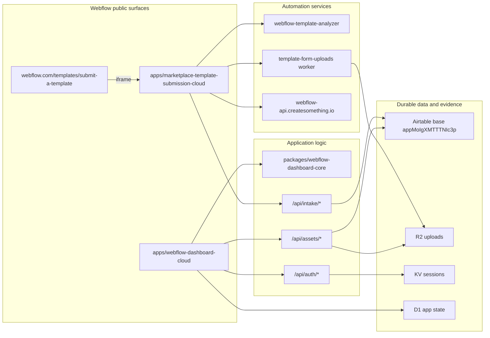
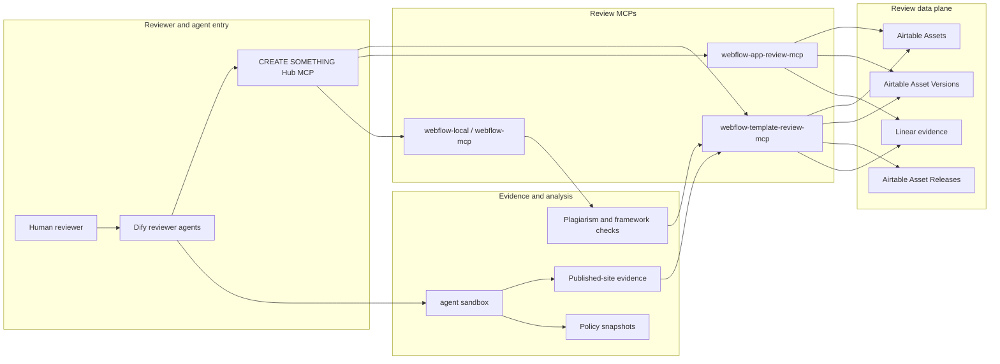
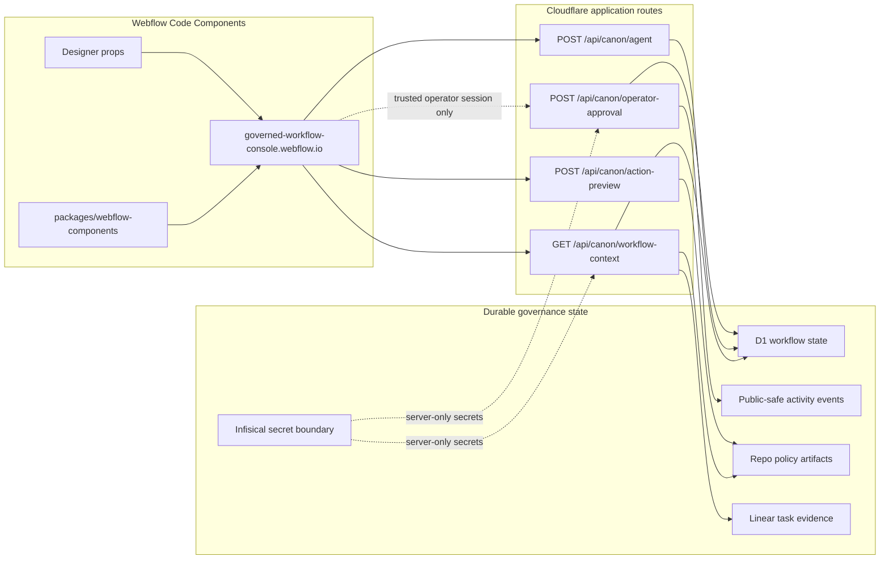

# Webflow Surface Ownership and Runtime Map

Last reviewed: 2026-05-14
Tracked work: CRE-319, CRE-320, CRE-322

This document is the canonical map for Webflow-related packages and runtime surfaces in this monorepo. It answers four questions:

- which Webflow surfaces are active, legacy, or experimental
- which package owns each surface
- which runtime and data-plane dependencies each surface needs
- where Webflow should render UI versus where CREATE SOMETHING should keep durable state, policy, credentials, and evidence

## Operating Boundary

Webflow is a rendering and workflow-entry surface. CREATE SOMETHING keeps durable source data, execution state, credentials, policy artifacts, telemetry, and evidence in Airtable, Cloudflare, Linear, Infisical, and this repo.

Default rule:

| Tier       | Webflow posture                                                                | CREATE SOMETHING posture                                                                |
| ---------- | ------------------------------------------------------------------------------ | --------------------------------------------------------------------------------------- |
| Database   | Accept user interaction and display trusted state.                             | Own Airtable, D1, KV, R2, telemetry, and generated evidence.                            |
| Automation | Embed apps, extensions, snippets, and Code Components.                         | Own workers, MCPs, analyzers, queue jobs, sync jobs, and deployment commands.           |
| Judgment   | Show reviewer or operator affordances only after policy is resolved elsewhere. | Own reviewer write boundaries, approval rules, prompt contracts, and escalation policy. |

For agent-assisted Webflow development, a fresh project export can be the fastest local read model for static HTML, CSS, classes, breakpoints, and assets. It is not the live source of truth. Use `docs/guides/WEBFLOW_EXPORT_FIRST_AGENT_WORKFLOW.md` for the export-first workflow, and keep MCP/API/CLI as the mutation, binding, and publication layer.

## Relationship Graphs

These graphs are intentionally flow-oriented. They show the operational relationships that matter during ownership review, incident triage, and promotion planning.

### Public Creator Flows



### Reviewer and Agent Flows



### Governance Code Components Boundary



## Current Product Surfaces

| Surface                                    | Primary package or config                                          | Runtime                                                                                  | Source of truth                                                                  | Status                                | Implications                                                                                                                                                                          |
| ------------------------------------------ | ------------------------------------------------------------------ | ---------------------------------------------------------------------------------------- | -------------------------------------------------------------------------------- | ------------------------------------- | ------------------------------------------------------------------------------------------------------------------------------------------------------------------------------------- |
| Creator dashboard Cloud port               | `apps/webflow-dashboard-cloud`, `packages/webflow-dashboard-core`  | Next.js 15 on Webflow Cloud/OpenNext                                                     | Airtable base `appMoIgXMTTTNIc3p`, R2 `UPLOADS`, KV `SESSIONS`, optional D1 `DB` | Active migration target               | This is the current authenticated dashboard path. Keep shared domain logic in `webflow-dashboard-core`; avoid adding new creator-critical work only to the older SvelteKit dashboard. |
| Legacy/source dashboard                    | `packages/webflow-dashboard`                                       | SvelteKit on Cloudflare                                                                  | Airtable, KV, R2, analytics APIs                                                 | Reference and possible legacy runtime | Treat as parity reference for the Cloud port. The parity matrix intentionally supersedes older conflicting readiness docs.                                                            |
| Marketplace template submission app        | `apps/marketplace-template-submission-cloud`                       | Webflow Cloud iframe on `webflow.com/templates/submit-a-template`                        | Airtable Automation webhooks, upload worker, Turnstile, sandbox/autofill output  | Active public submission surface      | The parent Webflow page owns the hero and iframe shell; the app owns creator/template form flow, validation, uploads, and webhook envelope.                                           |
| Marketplace Library submission app         | `apps/marketplace-template-submission-cloud`, `createsomethingtoday/webflow-library-submission-form` | Standalone Webflow Cloud app deployed by CLI or repo-backed Cloud import                 | Airtable Automation webhooks, D1 capture, upload worker, validation worker       | Active migration target               | Library apps do not need a Webflow page mount. Keep the GitHub repo as redundancy and route/link/embed `webflow.com/libraries/submit` only after deployment and Airtable dry-run evidence. |
| Marketplace validation utility            | `packages/check-asset-name-worker`                                 | Cloudflare Worker replacement for `check-asset-name.vercel.app`                          | Airtable Assets and creator/library user tables                                  | Migration utility                     | Provides repo-owned template and Library validation endpoints. Do not treat this alone as a migrated Library submission app; it covers validation checks used by public Webflow forms. |
| Webflow Code Components governance console | `packages/webflow-components`, `config/webflow/control-plane.json` | Webflow Code Components, published origin `https://governed-workflow-console.webflow.io` | Cloudflare/D1 context endpoint, repo policy, Linear evidence                     | Active governance UI path             | Webflow renders the console only. Approval endpoints must stay empty on public previews unless routed through a trusted authenticated operator proxy.                                 |
| Bundle scanner Code Component              | `packages/bundle-scanner`, `packages/bundle-scanner-core`          | React app and Webflow Code Component                                                     | Local browser scan state, scanner-core policy rules                              | Active internal adjunct               | Useful for app bundle review. It is not a durable compliance system unless findings are mirrored into Airtable/Linear or a review MCP.                                                |
| Webflow template search worker             | `packages/webflow-template-search`                                 | Cloudflare Worker + D1                                                                   | D1 search index synced from Airtable assets/categories/tags                      | Active utility                        | Search/admin sync depends on correct D1 binding and `SYNC_ADMIN_TOKEN`. Keep marketplace search separate from reviewer judgment.                                                      |
| Landing page/category filters              | `packages/landing-page-filter`, `packages/wf-search-category`      | Cloudflare Pages/functions and embeddable scripts                                        | Airtable category data, optional OpenAI category matching                        | Utility/legacy adjunct                | These affect public marketplace discoverability and category UX, not review decisions. Treat generated/minified assets as deploy artifacts.                                           |

## Review And Analyzer Surfaces

| Surface                                   | Primary package or config                | Runtime                                                                                             | Source of truth                                                              | Status                                        | Implications                                                                                                                                                                 |
| ----------------------------------------- | ---------------------------------------- | --------------------------------------------------------------------------------------------------- | ---------------------------------------------------------------------------- | --------------------------------------------- | ---------------------------------------------------------------------------------------------------------------------------------------------------------------------------- |
| Template Review MCP                       | `packages/webflow-template-review-mcp`   | Cloudflare Worker at `https://webflow-template-review-mcp.createsomething.workers.dev/mcp`          | Airtable Assets, Asset Versions, Asset Releases                              | Active reviewer automation                    | Normal template review reads/writes should go through this MCP, not raw Airtable. Write tools must stay bounded by confirmed field maps and reviewer assignment rules.       |
| App Review MCP                            | `packages/webflow-app-review-mcp`        | Cloudflare Worker at `https://webflow-app-review-mcp.createsomething.workers.dev/mcp`               | Airtable Assets and Asset Versions                                           | Active reviewer automation                    | Mirrors the template review posture for app assets. Broad metadata and marketplace-status writes remain outside normal reviewer flow unless explicitly requested.            |
| Retired site analyzer MCP                 | `packages/webflow-site-analyzer-mcp`     | Removed from active Hub/Dify routing                                                     | Historical published URL, preview URL, policy snapshot, and browser extraction code | Retired reviewer evidence surface             | Reviewer agents now use their sandbox for bounded published-site analysis. Designer-only findings remain manual unless direct evidence is supplied.                         |
| Local Webflow MCP                         | `packages/webflow-mcp`                   | Local stdio/HTTP or Worker at `https://webflow-mcp.createsomething.workers.dev/mcp`                 | Plagiarism worker/index, framework detection, scan stats                     | Active compatibility MCP                      | Kept as `webflow-local` for hub bundle compatibility. It provides plagiarism/framework tools, not authoritative reviewer writes.                                             |
| Template Analyzer extension/cloud backend | `packages/webflow-template-analyzer`     | Webflow Designer extension plus Cloudflare Container Worker `webflow-template-analyzer`             | Published URL analysis, generated autofill suggestions, screenshot artifacts | Active creator-assistance surface             | This is productized analyzer output for creators. Analyzer failures should degrade to manual entry without blocking unrelated submission steps.                              |
| Webflow Way Validator                     | `packages/webflow-template-validation`   | Next.js companion app, Designer extension, Cloudflare Worker `validation-worker`                    | Published-site checks and future Designer checks                             | Active validation surface                     | Current MVP emphasizes published-site Typography/Styles/Naming. Components/Variables need Webflow Apps SDK scope and should remain explicitly marked when not verified.      |
| GSAP validation worker                    | `packages/gsap-validation-worker`        | Cloudflare Worker + Workflow `gsap-validation-workflow`                                             | Crawled published-site code and GSAP usage checks                            | Active focused validator                      | Used for template compliance checks around GSAP/IX behavior. Keep CORS origins and async workflow binding aligned with consuming dashboards/forms.                           |
| Early Webflow review system               | `packages/webflow-review`                | Cloudflare Workers, Chrome extension, snippet, console scripts                                      | D1 review records, queues, browser API findings                              | Legacy/prototype reference                    | Useful historical implementation for hidden-content testing and snippet ideas. Do not treat as the canonical current reviewer hub unless it is re-promoted.                  |
| Webflow validation API                    | `packages/io/workers/webflow-validation` | Cloudflare Worker `webflow-validation`, custom route `webflow-api.createsomething.io/*`             | Airtable validation tables and webhook proxy                                 | Active legacy/public API                      | Provides template/library/app validation aliases. Library name checks must be scoped to Library assets to avoid template-name false positives. Keep CORS origin list conservative because it is directly callable from Webflow properties. |

## Automation And Operations Surfaces

| Surface                                        | Primary package or config                                              | Runtime                                                            | Source of truth                                          | Status                                              | Implications                                                                                                                                                                       |
| ---------------------------------------------- | ---------------------------------------------------------------------- | ------------------------------------------------------------------ | -------------------------------------------------------- | --------------------------------------------------- | ---------------------------------------------------------------------------------------------------------------------------------------------------------------------------------- |
| Webflow automation scripts and onboarding sync | `packages/webflow-automation`                                          | Airtable scripts and Worker `webflow-onboarding-sync`              | Airtable partner onboarding table, Slack/raw intake text | Active operations                                   | Owns Slack -> Airtable -> Codex -> Slack loop and legacy Airtable scripts for Experts/EPP workflows. Keep business state in Airtable; workers should only transition known states. |
| Webflow Apps Admin audit                       | `packages/webflow-apps-admin`                                          | Browser console scripts, planned extension, audit dashboard/worker | Webflow Apps admin pages and generated audit reports     | Internal/admin                                      | Current report found duplicate client IDs. This is admin tooling, not creator-facing product. Selectors may break if Webflow admin UI changes.                                     |
| Webflow Code Components intake                 | `packages/webflow-intake`                                              | Documentation/process package                                      | Intake notes and package graduation decisions            | Process/reference                                   | Defines IC MVP -> agentic engineering -> Code Components path. Use for new Code Component candidates before adding them to `webflow-components`.                                   |
| Dify MCP intake for Webflow                    | `config/dify-mcp-intake/webflow-*.json`                                | Dify Studio MCP registration workflow                              | Infisical secret references, Hub registry entries        | Pending Dify Studio registration for listed servers | These artifacts are not Dify inventory entries. Tool discovery and risk classification must happen before copying into `config/dify/inventory.json`.                               |
| MCP Hub registry bundles                       | `config/mcp-hub/registry*.json`, `config/mcp-hub/discovery-packs.json` | CREATE SOMETHING Hub MCP                                           | Registry and discovery-pack JSON                         | Active routing control plane                        | Current Webflow bundles separate template review phase A/B and app review phase A/B. Phase B template review keeps `webflow-local` only for plagiarism/framework tools.          |

## Public Flow Dependencies

### Creator Dashboard

Entry points:

- `apps/webflow-dashboard-cloud` UI routes: `/login`, `/verify`, `/dashboard`, `/assets/[id]`, `/marketplace`, `/submit`
- API routes documented in `apps/webflow-dashboard-cloud/README.md`

Runtime dependencies:

- Airtable API key and base ID
- `RESEND_API_KEY` and optional Knock login feature flag path in `webflow-dashboard-core`
- `SESSIONS` KV
- `UPLOADS` R2 bucket
- Webflow Cloud/OpenNext asset binding
- optional `TEMPLATE_ANALYZER_API_BASE`
- optional Turnstile secrets for intake bot protection

Operational implications:

- Auth/session, uploads, analytics, and profile/API-key flows are creator-critical.
- The Cloud app depends on `packages/webflow-dashboard-core` through a local `file:` dependency to survive subdirectory Webflow Cloud installs.
- The older SvelteKit dashboard remains a source reference, not the default place for new Cloud migration behavior.

### Marketplace Template Submission

Entry points:

- Parent Webflow page: `webflow.com/templates/submit-a-template`
- Embedded route: `apps/marketplace-template-submission-cloud` `/submit`
- Intake APIs: `/api/intake/*`

Runtime dependencies:

- Airtable API key/base ID
- Airtable Automation webhook envelope for creator/template submissions
- `UPLOADS_WORKER_SECRET`
- optional `UPLOADS_WORKER_URL`
- optional `TEMPLATE_ANALYZER_API_BASE`
- Turnstile secrets when enabled
- hash-versioned Webflow marketplace CSS import

Operational implications:

- The iframe and parent page communicate with `ts-submission:*` postMessage events for resize, UTM transfer, and scrolling.
- The parent Webflow page owns hero and mount position; the embedded app owns the form state machine.
- Analyzer suggestions are assistance, not reviewer approval.

### Marketplace Library Submission

Entry points:

- Public Library page: `webflow.com/libraries`
- Legacy public Library submit page: `webflow.com/libraries/submit`
- Standalone redundancy repo: `createsomethingtoday/webflow-library-submission-form`
- Legacy validation APIs referenced by the archived submit flow: `/api/checkLibraryname`, `/api/checkLibraryemail`, `/api/checkLibraryuser`

Runtime dependencies:

- Airtable API key/base ID
- Airtable Assets table with `Library📚` asset type values
- Creator or Library-user table with confirmed Library submission permission fields
- Repo-owned validation worker: `packages/check-asset-name-worker`
- Legacy validation alias worker: `packages/io/workers/webflow-validation`
- Library submission UI route: `apps/marketplace-template-submission-cloud` `/libraries/submit`
- Standalone Library app route: `webflow-library-submission-form` `/libraries/submit`
- Library submission API route: `apps/marketplace-template-submission-cloud` `/api/intake/library`
- Library thumbnail upload kind: `POST /api/intake/upload` with `kind=library-thumbnail`

Operational implications:

- The public Library pages may still load, but the implementation path is archived and should not be treated as an active Webflow Cloud submission surface.
- `packages/check-asset-name-worker` now owns Library validation parity for name, email, and user checks.
- `apps/marketplace-template-submission-cloud` now owns the Library submission form at `/libraries/submit`, plus the Library submission webhook envelope and D1 capture route at `/api/intake/library`.
- The standalone `webflow-library-submission-form` repo mirrors this app for redundancy, GitHub-backed Webflow Cloud import, and direct CLI deployment.
- Library name availability must scope Airtable checks to `Library📚` assets so template names do not block Library submissions.
- Before routing production Library submit traffic to the worker, confirm `check-asset-name` returns `canSubmitLibraries: true` for one approved creator email.
- A complete Library migration still needs a production Webflow Cloud app URL, confirmed Airtable Automation branch mapping, one approved dry run, and reviewer handoff evidence. Public page routing is optional legacy continuity, not the deployment boundary.

### Template Review Hub

Entry points:

- Dify/Hub services for template reviewers
- `webflow-template-review-mcp`
- `webflow-local` for plagiarism/framework tools
- agent sandbox for bounded published-site review evidence

Runtime dependencies:

- Airtable PAT and base ID
- `MCP_API_KEY`/bearer token from Infisical
- Reviewer directory JSON for identity mapping
- agent sandbox/network execution for published-site crawl evidence

Operational implications:

- Normal reviews should start with template review MCP queue/context tools.
- Automated analysis should use the agent sandbox with the published URL only unless manual Designer diagnostics are explicitly requested.
- Before any Airtable write, reviewer agents must verify context capability flags and receive explicit user approval.

### App Review Hub

Entry points:

- Dify/Hub services for app reviewers
- `webflow-app-review-mcp`
- `webflow-apps-admin` audits for admin-side investigation
- `bundle-scanner` for bundle/security policy triage

Runtime dependencies:

- Airtable PAT and base ID
- `MCP_API_KEY`/bearer token from Infisical
- reviewer directory JSON
- browser access to Webflow Apps admin for console/audit scripts

Operational implications:

- The app review MCP owns bounded app asset/version workflow writes.
- Client ID audit tooling is admin-side evidence gathering; write decisions should be mirrored through app review workflow tools or tracked evidence.
- Bundle scanner findings are local until persisted elsewhere.

### Governance Console

Entry points:

- Webflow Code Components library `CREATE SOMETHING Canon Components`
- published origin `https://governed-workflow-console.webflow.io`
- Cloudflare routes such as `/api/canon/workflow-context`, `/api/canon/agent`, `/api/canon/action-preview`, and trusted approval proxy routes

Runtime dependencies:

- `packages/webflow-components`
- `config/webflow/control-plane.json`
- Cloudflare/D1 workflow context
- Linear evidence
- repo policy artifacts
- optional authenticated `.agency` session for operator-only approval

Operational implications:

- Public `webflow.io` previews should remain read-only or local-state only.
- Never place internal API keys or token-bearing endpoints in Webflow props or browser code.
- Sharing the Webflow library is externally visible and should be done only after `pnpm webflow:governance:verify`.

## Production, Legacy, Experimental

| Class                                     | Surfaces                                                                                                                                                                                                                                                                                                                                                               |
| ----------------------------------------- | ---------------------------------------------------------------------------------------------------------------------------------------------------------------------------------------------------------------------------------------------------------------------------------------------------------------------------------------------------------------------- |
| Active production or production-candidate | `apps/webflow-dashboard-cloud`, `apps/marketplace-template-submission-cloud`, `packages/webflow-components`, `packages/webflow-template-review-mcp`, `packages/webflow-app-review-mcp`, `packages/webflow-template-analyzer`, `packages/webflow-template-validation`, `packages/webflow-mcp`, `packages/webflow-template-search` |
| Active internal/admin                     | `packages/webflow-apps-admin`, `packages/bundle-scanner`, `packages/bundle-scanner-core`, `packages/webflow-automation`, `packages/webflow-intake`                                                                                                                                                                                                                     |
| Utility or embedded scripts               | `packages/check-asset-name-worker`, `packages/landing-page-filter`, `packages/wf-search-category`, `packages/gsap-validation-worker`, `packages/io/workers/webflow-validation`                                                                                                                                                                                          |
| Legacy/reference                          | `packages/webflow-dashboard`, `packages/webflow-review`, `packages/webflow-site-analyzer-mcp`                                                                                                                                                                                                                                                                          |

## Follow-Up Implications

1. Keep one owner doc per active Webflow surface. Each should declare runtime URL, deployment command, required secrets, rollback note, and evidence location.
2. Reconcile old dashboard docs against `specs/webflow-dashboard-cloud-parity-matrix.md`; when they disagree, prefer the parity matrix and current code.
3. Add a generated or checked registry view that connects public Webflow flows to their MCP/worker dependencies, so outage triage starts from a flow rather than a package name.
4. Keep Dify intake artifacts pending until tools are discovered and classified; do not paste empty fragments into inventory.
5. Treat sandbox analysis output differently by role: creators receive validation/autofill assistance; reviewers receive evidence with caveats and manual-state boundaries.
6. Make credential boundaries explicit in Webflow Code Components. Public Webflow props must not contain internal credentials or direct mutation endpoints.

## Validation Commands

Use the narrowest command that matches the changed surface:

```bash
pnpm --filter @create-something/webflow-dashboard-cloud check
pnpm --filter @create-something/marketplace-template-submission-cloud check
pnpm --filter @create-something/webflow-dashboard-core check
pnpm --filter @create-something/webflow-dashboard-core test
pnpm --filter @create-something/webflow-template-review-mcp test
pnpm --filter @create-something/webflow-app-review-mcp test
pnpm --filter @create-something/check-asset-name-worker test
pnpm --filter @create-something/webflow-template-search test
pnpm webflow:governance:verify
pnpm dify:mcp:intake:check
pnpm dify:inventory:check
pnpm dify:coverage:check
```

For this map itself, verify with:

```bash
rg -n "WEBFLOW_SURFACE_OWNERSHIP_RUNTIME_MAP|Webflow Surface Ownership|Relationship Graphs" docs/README.md docs/WEBFLOW_SURFACE_OWNERSHIP_RUNTIME_MAP.md docs/WEBFLOW_SURFACE_OWNERSHIP_RUNTIME_MAP.html
```
