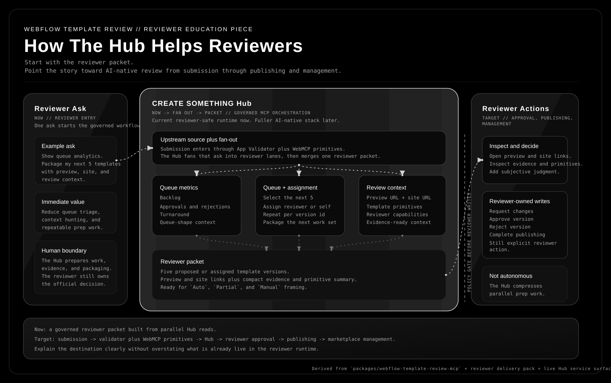

# Webflow Template Review Hub Reviewer Parallel Visualization

This is the education piece that works best for explaining the reviewer value of the Webflow Template Review Hub.

Use it as the opening frame for the Marketplace walkthrough and reviewer onboarding. It shows the operational takeaway in one pass while also pointing to the target AI-native workflow:

- one reviewer request can trigger parallel governed reads
- the Hub can combine metrics, queue selection or assignment, and per-template context into one reviewer-ready packet
- the reviewer still owns the final approval or rejection action
- the broader destination is submission through publishing and management with richer template primitives flowing in through a WebMCP-enabled validator surface

## Why this works best

- The current delivery pack already explains workflow, fallback, and policy in prose.
- The generic Hub and Codex visualization explains governance, but it does not show the reviewer time-saving story clearly.
- A long paper is too indirect for the Marketplace audience. The immediate question is how the Hub helps reviewers clear queue work faster without losing control.
- It can hold both the current safe reviewer lane and the target full AI-native lane without pretending those two states are already identical.
- The live Hub already exposes the surfaces needed for this story:
  - `template_review_get_metrics`
  - `template_review_list_queue`
  - `template_review_assign_reviewer`
  - `template_review_assign_self`
  - `template_review_my_queue`
  - `template_review_get_review_context`

## What to say with the visual

1. One reviewer or review lead asks for workload help.
2. The Hub fans that request into parallel lanes:
   - analytics for queue shape
   - queue selection and reviewer assignment
   - per-template context with preview and site links
3. The outputs merge into a single reviewer packet.
4. The reviewer inspects evidence and decides whether to request changes, approve, reject, complete publishing, or keep reviewing.
5. In the target state, richer template primitives enter through the WebMCP-enabled App Validator so the Hub can orchestrate more of the review surface from submission through marketplace management.

## Important boundary

- The five-template reviewer packet is an orchestration pattern inferred from the live tools, not a single dedicated bulk-assignment tool.
- The Hub has per-version assignment plus queue and context reads, so a host can repeat those calls safely and package the result as one brief.
- Final decision writes remain reviewer-owned and approval-gated.
- As of the current runtime posture, `webflow-template-review-mcp` is the only connected reviewer-safe Webflow server. The broader App Validator, WebMCP, and analysis story should be presented as the intended Phase B and beyond state unless those servers are live in the Hub.

## Recommended placement

- Open the Marketplace team walkthrough with this visual.
- Reuse it before the `Auto` / `Partial` / `Manual` explanation in reviewer onboarding.
- Say the future-state sentence out loud once: "the Hub is the AI-native reviewer operating surface from submission to marketplace publishing and management."
- Keep the follow-on demo concrete: show metrics, show queue and context, then stop at the reviewer-owned action boundary unless the broader review servers are actually enabled.

## Grounding

- Queue items already expose `assignableVersionId`, `websiteUrl`, `previewSiteUrl`, and reviewer-safe capability flags.
- Review context already returns reviewer-facing asset and version data through one normalized surface.
- The broader WebMCP path already has an implementation anchor in `webflow-site-analyzer-mcp` through `run_template_review`, which combines Designer scoring with a published-site WebMCP crawl.
- The reviewer workflow docs already frame the Hub as acceleration for objective work, not autonomous judgment.

Primary repo anchors:

- `packages/webflow-template-review-mcp/src/tools.ts`
- `packages/webflow-template-review-mcp/src/airtable.ts`
- `packages/webflow-site-analyzer-mcp/src/index.ts`
- `specs/webflow-marketplace/delivery/template-review-hub/reviewer-playbook.md`
- `specs/webflow-marketplace/delivery/template-review-hub/team-walkthrough.md`
