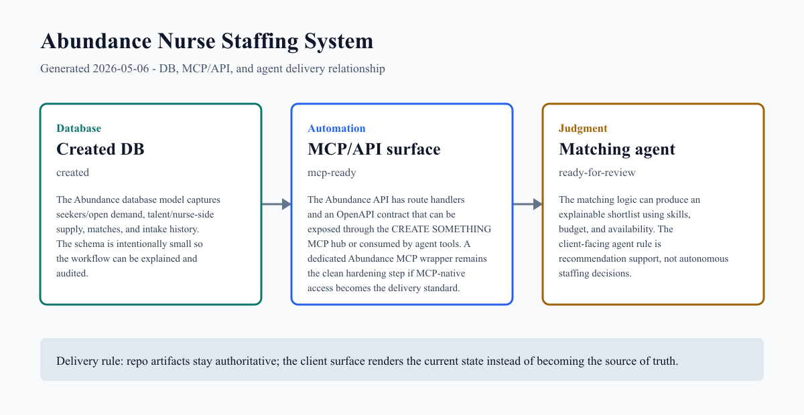
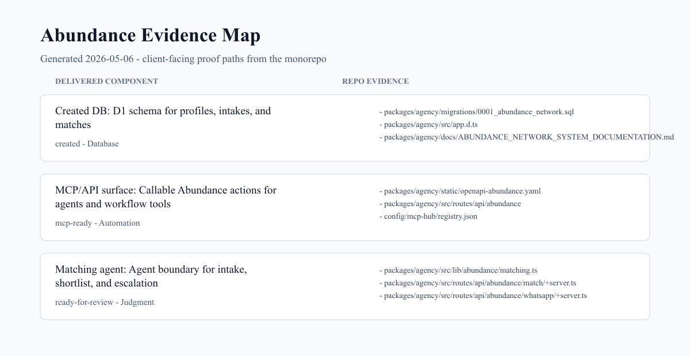

# Abundance Nurse Staffing System Project Update

**Client:** Half Dozen
**Audience:** client_summary
**Generated:** 2026-05-06

Abundance now has a repo-backed database, API/MCP-facing contract surface, and matching-agent boundary that can be delivered as a visible client update instead of a loose status note.

## Client Summary

The project has moved from concept into a concrete operating system shape: profile data, matching data, intake history, API routes, an OpenAPI contract, and a client-facing explanation layer all live in the monorepo.

The current delivery should show the relationship between the created database, the API/MCP surface, and the agent behavior: what the system stores, what tools can be called, and where human review still belongs.

The client-ready message should avoid internal tool sprawl. It should say: the nurse intake and matching workflow now has durable data, callable actions, and explainable recommendations.

## DB, MCP, and Agent Map

| Layer | Status | What changed | Evidence |
| --- | --- | --- | --- |
| Created DB | created | The Abundance database model captures seekers/open demand, talent/nurse-side supply, matches, and intake history. The schema is intentionally small so the workflow can be explained and audited. | [migrations/0001_abundance_network.sql](../../../packages/agency/migrations/0001_abundance_network.sql)<br>[src/app.d.ts](../../../packages/agency/src/app.d.ts) |
| MCP/API surface | mcp-ready | The Abundance API has route handlers and an OpenAPI contract that can be exposed through the CREATE SOMETHING MCP hub or consumed by agent tools. A dedicated Abundance MCP wrapper remains the clean hardening step if MCP-native access becomes the delivery standard. | [static/openapi-abundance.yaml](../../../packages/agency/static/openapi-abundance.yaml)<br>[api/abundance](../../../packages/agency/src/routes/api/abundance) |
| Matching agent | ready-for-review | The matching logic can produce an explainable shortlist using skills, budget, and availability. The client-facing agent rule is recommendation support, not autonomous staffing decisions. | [abundance/matching.ts](../../../packages/agency/src/lib/abundance/matching.ts)<br>[match/+server.ts](../../../packages/agency/src/routes/api/abundance/match/+server.ts) |

## Delivery Images





### Image 2 Prompt Sources

These image prompts target gpt-image-2 and are stored with the delivery assets.

- [abundance-image2-delivery-graph-2026-05-06.txt](assets/prompts/abundance-image2-delivery-graph-2026-05-06.txt)
- [abundance-image2-evidence-map-2026-05-06.txt](assets/prompts/abundance-image2-evidence-map-2026-05-06.txt)

## Client-Ready Update

We have the first durable Abundance system shape in place: a database for nurse/candidate-side profile history and matching state, callable workflow routes for intake and match creation, and a matching layer that returns visible reasons rather than black-box decisions.

The current implementation supports the core operating path: capture profile context, preserve intake history, create or update demand/supply records, generate suggested matches, and keep the recruiter/human review boundary visible.

The next useful review is not another brainstorm. It is a walkthrough of the DB, callable actions, and agent recommendation boundary using the generated delivery images below.

## Repo Evidence

| Component | Path | Type | Details |
| --- | --- | --- | --- |
| Created DB | [packages/agency/migrations/0001_abundance_network.sql](../../../packages/agency/migrations/0001_abundance_network.sql) | file | 155 lines |
| Created DB | [packages/agency/src/app.d.ts](../../../packages/agency/src/app.d.ts) | file | 98 lines |
| Created DB | [packages/agency/docs/ABUNDANCE_NETWORK_SYSTEM_DOCUMENTATION.md](../../../packages/agency/docs/ABUNDANCE_NETWORK_SYSTEM_DOCUMENTATION.md) | file | 552 lines |
| MCP/API surface | [packages/agency/static/openapi-abundance.yaml](../../../packages/agency/static/openapi-abundance.yaml) | file | 839 lines |
| MCP/API surface | [packages/agency/src/routes/api/abundance](../../../packages/agency/src/routes/api/abundance) | directory | 8 files |
| MCP/API surface | [config/mcp-hub/registry.json](../../../config/mcp-hub/registry.json) | file | 16066 lines |
| MCP/API surface | [config/mcp-hub/fleet.json](../../../config/mcp-hub/fleet.json) | file | 429 lines |
| Matching agent | [packages/agency/src/lib/abundance/matching.ts](../../../packages/agency/src/lib/abundance/matching.ts) | file | 176 lines |
| Matching agent | [packages/agency/src/routes/api/abundance/match/+server.ts](../../../packages/agency/src/routes/api/abundance/match/+server.ts) | file | 212 lines |
| Matching agent | [packages/agency/src/routes/api/abundance/whatsapp/+server.ts](../../../packages/agency/src/routes/api/abundance/whatsapp/+server.ts) | file | 286 lines |
| Matching agent | [packages/ltd/src/routes/presentations/abundance-system/+page.svelte](../../../packages/ltd/src/routes/presentations/abundance-system/+page.svelte) | file | 306 lines |

## Recent Related Commits

- 4d42f2f44 2026-03-12 Update nurse acquisition media plan
- ce6127736 2026-03-12 Locate meeting 2026-03-10 2pm CT
- 59d6191fb 2026-03-12 feat: add abundance staffing budget benchmarks
- 2842b0051 2026-03-10 Review and deploy MCP Hub deck
- 3cb80ab9f 2025-12-30 fix(agency): add safeJsonParse utility for abundance endpoints
- bf9132473 2025-12-29 docs(agency): enrich docs with Canon philosophical concepts
- 610ed5f7d 2025-12-13 feat(agency): add abundance assessment and service delivery

## Next Review

- Confirm whether the client-facing vocabulary should stay nurse staffing-specific or preserve the generic Seeker/Talent/Match API names underneath.
- Decide whether to ship a dedicated Abundance MCP package now or keep the current OpenAPI-plus-hub route until the client workflow stabilizes.
- Capture real screenshots from the deployed presentation/control surface once the client-visible route is promoted.

## Regenerate

```bash
pnpm delivery:abundance
```
