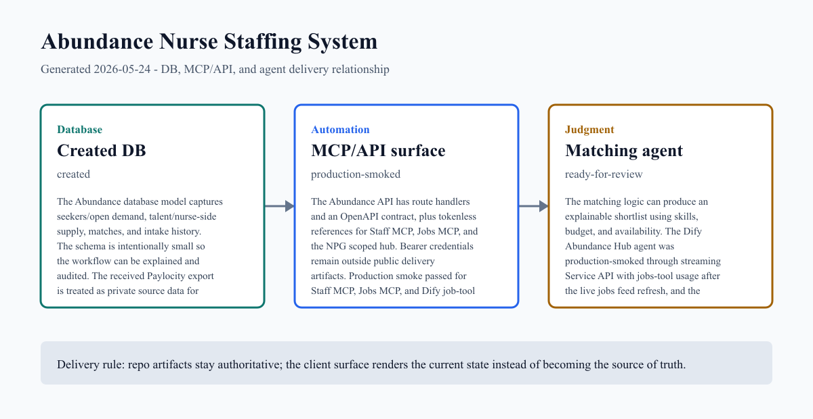
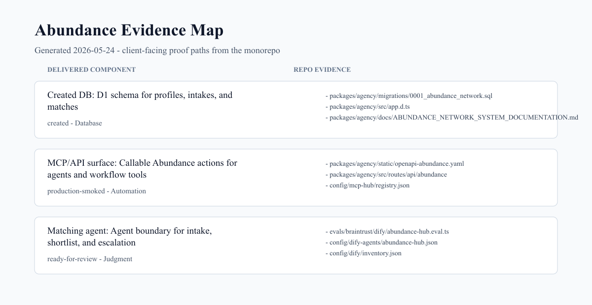

# Abundance Nurse Staffing System Project Update

**Client:** The NP Group
**Client shorthand:** NPG
**Audience:** client_summary
**Generated:** 2026-05-24

Abundance now has a refreshed live jobs feed, production-smoked Staff and Jobs MCPs, and a client-safe operating review package.

## Client Context

This delivery is tied to The NP Group — Abundance AI-native staffing pipeline in CREATE SOMETHING Notion / Agency Ops. The Notion context was reviewed from the CREATE SOMETHING root and its Agency Ops records. The public artifact names the client context, but does not expose private Notion URLs, contacts, or raw workspace data.

## Client Summary

The project has moved from concept into a concrete operating system shape: a live concierge app, profile data, matching data, intake history, hardened API routes, Staff and Jobs MCP endpoints, a refreshed live jobs feed, walkthrough artifacts, and a client-facing explanation layer.

The current delivery shows the relationship between the created database, the staff/jobs MCP surfaces, the embedded Dify Abundance Hub jobs agent, the Braintrust/Langfuse eval evidence, and the human review boundary: what the system stores, what tools can be called, how behavior is observed, and where recruiter/operator approval still belongs.

Production smoke passed on 2026-05-24 after the managed public jobs data feed was refreshed. The delivery page, delivery ask endpoint, Staff MCP headcount summary, Jobs MCP public listing, and Dify Abundance Hub streaming tool use all returned expected results. The NPG scoped hub service inventory remains a separate operating follow-up for Jotform/Mailchimp/WhatsApp exposure and authorization before write-capable automation.

A private Paylocity active-headcount export has been received for staff/operator context. Employee-level rows, token-bearing MCP access, Dify keys, and NPG external account authorization details remain private and are not included in the public delivery.

Remaining production promotion work is operational rather than architectural: provision WhatsApp webhook secrets before enabling Meta webhooks, promote the secured agency build from a clean release branch, confirm Paylocity field mapping, and have NPG account owners review or reauthorize Jotform, Mailchimp, and WhatsApp before write-capable automation.

## DB, MCP, and Agent Map

| Layer | Status | What changed | Evidence |
| --- | --- | --- | --- |
| Created DB | created | The Abundance database model captures seekers/open demand, talent/nurse-side supply, matches, and intake history. The schema is intentionally small so the workflow can be explained and audited. The received Paylocity export is treated as private source data for the next staff/operator integration pass. | [migrations/0001_abundance_network.sql](../../../packages/agency/migrations/0001_abundance_network.sql)<br>[src/app.d.ts](../../../packages/agency/src/app.d.ts) |
| MCP/API surface | production-smoked | The Abundance API has route handlers and an OpenAPI contract, plus tokenless references for Staff MCP, Jobs MCP, and the NPG scoped hub. Bearer credentials remain outside public delivery artifacts. Production smoke passed for Staff MCP, Jobs MCP, and Dify job-tool usage after the managed jobs feed refresh. NPG scoped hub service exposure and Jotform/Mailchimp/WhatsApp authorization remain separate operating follow-ups. | [static/openapi-abundance.yaml](../../../packages/agency/static/openapi-abundance.yaml)<br>[api/abundance](../../../packages/agency/src/routes/api/abundance) |
| Matching agent | ready-for-review | The matching logic can produce an explainable shortlist using skills, budget, and availability. The Dify Abundance Hub agent was production-smoked through streaming Service API with jobs-tool usage after the live jobs feed refresh, and the published Braintrust eval passed against the Dify/MCP path. The delivery page embeds a server-side read-only jobs chat for client review. The client-facing rule remains recommendation support, not autonomous staffing decisions. | [dify/abundance-hub.eval.ts](../../../evals/braintrust/dify/abundance-hub.eval.ts)<br>[dify-agents/abundance-hub.json](../../../config/dify-agents/abundance-hub.json) |

## Delivery Artifacts

| Artifact | Visibility | Kind | Link / Status |
| --- | --- | --- | --- |
| Abundance Concierge live app | client_summary | cloudflare_pages_app | [Abundance Concierge live app](https://abundance-concierge-chat.pages.dev/) |
| Abundance Jobs Agent | client_summary | delivery_page_embedded_agent | [Abundance Jobs Agent](https://createsomething.agency/delivery/abundance#job-agent) |
| Nurse Staffing Concierge Progress Walkthrough | client_summary | descript_walkthrough | [Nurse Staffing Concierge Progress Walkthrough](https://share.descript.com/view/RWYv3CqKbEC) |
| Abundance Concierge Pilot Overview | client_summary | descript_walkthrough | [Abundance Concierge Pilot Overview](https://share.descript.com/view/0wxPcYQzl8G) |
| Book Operating Review | client_summary | booking_link | [Book Operating Review](https://createsomething.agency/book) |
| Abundance Staff MCP | private_internal | remote_mcp_server | [Abundance Staff MCP](https://abundance-staff-mcp.createsomething.workers.dev/mcp) |
| Abundance Jobs MCP | private_internal | remote_mcp_server | [Abundance Jobs MCP](https://abundance-jobs-mcp.createsomething.workers.dev/mcp) |
| Paylocity Active Headcount export | private_internal | private_csv_export | Received private Paylocity export with 198 employee rows and 20 columns. Raw rows, local file path, and employee-level data are intentionally excluded from the public delivery. |
| Abundance Hub Dify agent config | private_internal | external_agent_config | Dify Abundance Hub agent configuration for public nursing job discovery. The delivery page embeds the agent through a server-side read-only chat panel. The Service API key remains in Infisical, and the Dify smoke passed after the live jobs feed refresh without exposing secret values. |

## Delivery Images





### Image 2 Prompt Sources

These image prompts target gpt-image-2 and are stored with the delivery assets.

- [abundance-image2-delivery-graph-2026-05-24.txt](assets/prompts/abundance-image2-delivery-graph-2026-05-24.txt)
- [abundance-image2-evidence-map-2026-05-24.txt](assets/prompts/abundance-image2-evidence-map-2026-05-24.txt)

## Client-Ready Update

We have the first durable Abundance system shape in place: a live nurse-facing concierge app, a database for nurse/candidate-side profile history and matching state, hardened callable workflow routes, deployed Staff and Jobs MCP endpoints, a refreshed live jobs feed, and a matching layer that returns visible reasons rather than black-box decisions.

The current implementation supports the core operating path: capture profile context, preserve intake history, create or update demand/supply records, generate suggested matches idempotently, and keep the recruiter/human review boundary visible.

The production smoke on 2026-05-24 passed for the public delivery surface, Staff MCP headcount summary, Jobs MCP public listing, and Dify Abundance Hub streaming job-tool use after the managed public jobs data feed was refreshed. The delivery page includes a server-side embedded jobs chat panel constrained to read-only public job discovery. The NPG scoped hub service inventory and Jotform/Mailchimp/WhatsApp authorization remain separate operating follow-ups before write-capable automation.

We also received the Paylocity active-headcount export as private source data for the next staff/operator integration pass. That data is acknowledged here as an artifact, but employee-level records are not included in the public delivery.

The next useful review is a 30-minute operating walkthrough with Stacey, Latasha, and any operations team members who should give input on priority markets, operator access, Staff/Jobs MCP boundaries, and the agent recommendation boundary.

## Repo Evidence

| Component | Path | Type | Details |
| --- | --- | --- | --- |
| Created DB | [packages/agency/migrations/0001_abundance_network.sql](../../../packages/agency/migrations/0001_abundance_network.sql) | file | 155 lines |
| Created DB | [packages/agency/src/app.d.ts](../../../packages/agency/src/app.d.ts) | file | 102 lines |
| Created DB | [packages/agency/docs/ABUNDANCE_NETWORK_SYSTEM_DOCUMENTATION.md](../../../packages/agency/docs/ABUNDANCE_NETWORK_SYSTEM_DOCUMENTATION.md) | file | 552 lines |
| MCP/API surface | [packages/agency/static/openapi-abundance.yaml](../../../packages/agency/static/openapi-abundance.yaml) | file | 839 lines |
| MCP/API surface | [packages/agency/src/routes/api/abundance](../../../packages/agency/src/routes/api/abundance) | directory | 8 files |
| MCP/API surface | [config/mcp-hub/registry.json](../../../config/mcp-hub/registry.json) | file | 16545 lines |
| MCP/API surface | [config/mcp-hub/fleet.json](../../../config/mcp-hub/fleet.json) | file | 497 lines |
| Matching agent | [evals/braintrust/dify/abundance-hub.eval.ts](../../../evals/braintrust/dify/abundance-hub.eval.ts) | file | 431 lines |
| Matching agent | [config/dify-agents/abundance-hub.json](../../../config/dify-agents/abundance-hub.json) | file | 131 lines |
| Matching agent | [config/dify/inventory.json](../../../config/dify/inventory.json) | file | 3130 lines |
| Matching agent | [packages/agency/src/lib/abundance/matching.ts](../../../packages/agency/src/lib/abundance/matching.ts) | file | 176 lines |
| Matching agent | [packages/agency/src/routes/api/abundance/match/+server.ts](../../../packages/agency/src/routes/api/abundance/match/+server.ts) | file | 237 lines |
| Matching agent | [packages/agency/src/routes/api/abundance/whatsapp/+server.ts](../../../packages/agency/src/routes/api/abundance/whatsapp/+server.ts) | file | 310 lines |
| Matching agent | [packages/ltd/src/routes/presentations/abundance-system/+page.svelte](../../../packages/ltd/src/routes/presentations/abundance-system/+page.svelte) | file | 303 lines |

## Recent Related Commits

- c984f88d5 2026-05-17 Harden Dify reviewer E2B coverage
- eb7629c3c 2026-05-14 Fix Abundance webhook route exports
- 6ce128dfa 2026-05-14 Ship Abundance production delivery
- 8bcf02fc2 2026-05-09 Add public MCP and agent trust catalog
- 7a26bc36d 2026-04-30 Codify Vicki Dify Hub agent
- 06e3cec37 2026-04-30 Codify Mariana Dify Hub agent
- c5da1af92 2026-04-30 Codify Natalia Dify Hub agent
- 7f617ffdf 2026-04-30 Codify Eric Dify Hub agent

## Next Review

- Book the next available operating review with Stacey, Latasha, and any operations team members who should give input.
- Confirm priority staffing markets and the first employer/facility source list for live jobs review.
- Provision WHATSAPP_VERIFY_TOKEN and WHATSAPP_APP_SECRET in the Cloudflare Pages production environment before enabling the Meta webhook route.
- Promote the secured Abundance API build from a clean release branch or clean deployment workspace after the Abundance hardening tests and agency check pass.
- Review NPG scoped hub service exposure and have account owners reauthorize Jotform, Mailchimp, and WhatsApp before allowing write-capable automation through the scoped hub.
- Confirm how Paylocity active-headcount fields should map into staff/operator records before importing or enriching production data.
- Confirm the operator roster and access owner for MCP/database access.

## Regenerate

```bash
pnpm delivery:abundance
```
