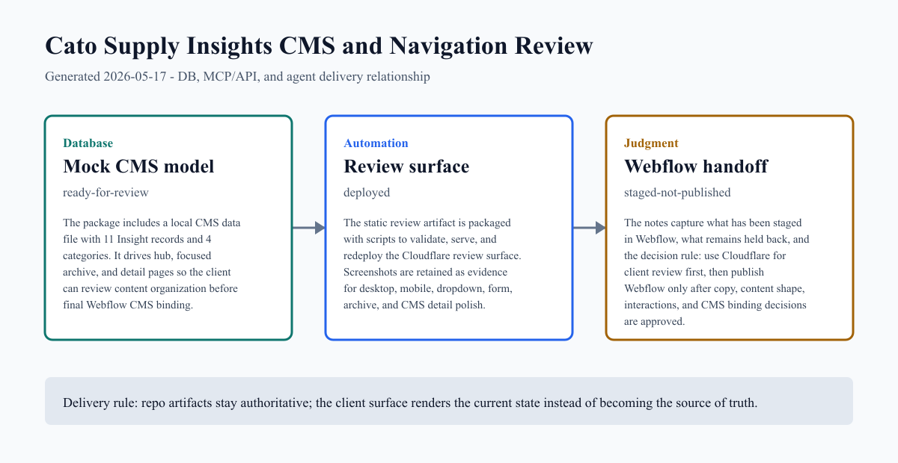
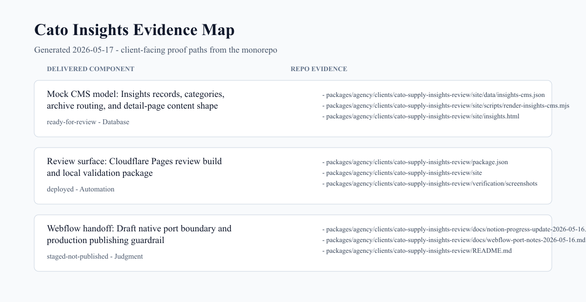

# Cato Supply Insights CMS and Navigation Review Project Update

**Client:** Cato Supply
**Client shorthand:** Cato
**Audience:** client_summary
**Generated:** 2026-05-17

Cato now has a repo-backed Insights review package, Cloudflare review URL, mock CMS content model, and staged Webflow navigation work for client review before production publishing.

## Client Context

This delivery is prepared for the Cato Supply Insights CMS and navigation review record in CREATE SOMETHING Notion / Agency Ops. The repo artifact is ready to mirror into Notion when the Notion connector is available, and it avoids private Notion URLs, contacts, Webflow credentials, and unpublished client data.

## Client Summary

The Cato Insights work has been moved out of temporary local scratch space and into a durable client package at packages/agency/clients/cato-supply-insights-review.

The Cloudflare review surface is live and ready for client review. It includes the Insights hub, Resiliency Report Alerts subscribe/archive page, Cato Research, Resource Library, Newsroom, and generated detail pages from the mock CMS data set.

The local static review has a single shared dropdown behavior layer: About remains compact, Insights remains a featured mega menu, hover/focus/Escape behavior is predictable, ARIA state is synced, and mobile does not inherit desktop hover assumptions.

Native Webflow work has started through MCP. The shared Nav component has aligned About styling and a staged Insights native dropdown, but Webflow publishing remains intentionally held until the client approves the review surface and CMS binding plan.

The remaining production work is mostly Webflow-native CMS binding and publishing: turn the mocked content shape into Collection Lists/templates, connect final fields, confirm page copy, QA, and publish only after approval.

## DB, MCP, and Agent Map

| Layer | Status | What changed | Evidence |
| --- | --- | --- | --- |
| Mock CMS model | ready-for-review | The package includes a local CMS data file with 11 Insight records and 4 categories. It drives hub, focused archive, and detail pages so the client can review content organization before final Webflow CMS binding. | [data/insights-cms.json](../../../packages/agency/clients/cato-supply-insights-review/site/data/insights-cms.json)<br>[scripts/render-insights-cms.mjs](../../../packages/agency/clients/cato-supply-insights-review/site/scripts/render-insights-cms.mjs) |
| Review surface | deployed | The static review artifact is packaged with scripts to validate, serve, and redeploy the Cloudflare review surface. Screenshots are retained as evidence for desktop, mobile, dropdown, form, archive, and CMS detail polish. | [cato-supply-insights-review/package.json](../../../packages/agency/clients/cato-supply-insights-review/package.json)<br>[cato-supply-insights-review/site](../../../packages/agency/clients/cato-supply-insights-review/site) |
| Webflow handoff | staged-not-published | The notes capture what has been staged in Webflow, what remains held back, and the decision rule: use Cloudflare for client review first, then publish Webflow only after copy, content shape, interactions, and CMS binding decisions are approved. | [docs/notion-progress-update-2026-05-16.md](../../../packages/agency/clients/cato-supply-insights-review/docs/notion-progress-update-2026-05-16.md)<br>[docs/webflow-port-notes-2026-05-16.md](../../../packages/agency/clients/cato-supply-insights-review/docs/webflow-port-notes-2026-05-16.md) |

## Delivery Artifacts

| Artifact | Visibility | Kind | Link / Status |
| --- | --- | --- | --- |
| Cato Insights Review | client_summary | cloudflare_pages_review | [Cato Insights Review](https://cato-supply-insights-review.pages.dev/insights) |
| Resiliency Detail Example | client_summary | cloudflare_pages_review | [Resiliency Detail Example](https://cato-supply-insights-review.pages.dev/2026-supply-disruption-preparedness-brief) |
| Webflow native draft | private_internal | webflow_designer | Native Webflow Nav component changes were staged through MCP, but no Webflow site publish or custom-domain production publish was performed. |

## Delivery Images





## Client-Ready Update

I moved the Cato Insights review work into a durable repo-backed package so it is no longer sitting in temporary local scratch space.

The review URL is live and ready to share: https://cato-supply-insights-review.pages.dev/insights. It shows the Insights hub, focused pages, Resiliency subscribe/archive flow, newsroom/resource/research sections, and representative CMS detail pages.

The navigation work now has a clearer interaction model. About remains a compact dropdown, Insights remains the richer mega menu, and the local review build supports hover/focus open, Escape/outside close, ARIA state sync, and mobile-safe behavior.

I also staged the Webflow-native direction through MCP, including Nav component styling and the Insights dropdown structure, but I did not publish Webflow production domains. The Cloudflare URL should be the review surface until the client approves the direction.

Next, we should collect client feedback on copy, menu balance, subscribe/archive expectations, and CMS content shape, then connect the Webflow CMS Collection Lists/templates and publish after approval.

## Repo Evidence

| Component | Path | Type | Details |
| --- | --- | --- | --- |
| Mock CMS model | [packages/agency/clients/cato-supply-insights-review/site/data/insights-cms.json](../../../packages/agency/clients/cato-supply-insights-review/site/data/insights-cms.json) | file | 494 lines |
| Mock CMS model | [packages/agency/clients/cato-supply-insights-review/site/scripts/render-insights-cms.mjs](../../../packages/agency/clients/cato-supply-insights-review/site/scripts/render-insights-cms.mjs) | file | 321 lines |
| Mock CMS model | [packages/agency/clients/cato-supply-insights-review/site/insights.html](../../../packages/agency/clients/cato-supply-insights-review/site/insights.html) | file | 1877 lines |
| Review surface | [packages/agency/clients/cato-supply-insights-review/package.json](../../../packages/agency/clients/cato-supply-insights-review/package.json) | file | 16 lines |
| Review surface | [packages/agency/clients/cato-supply-insights-review/site](../../../packages/agency/clients/cato-supply-insights-review/site) | directory | 201 files |
| Review surface | [packages/agency/clients/cato-supply-insights-review/verification/screenshots](../../../packages/agency/clients/cato-supply-insights-review/verification/screenshots) | directory | 39 files |
| Webflow handoff | [packages/agency/clients/cato-supply-insights-review/docs/notion-progress-update-2026-05-16.md](../../../packages/agency/clients/cato-supply-insights-review/docs/notion-progress-update-2026-05-16.md) | file | 39 lines |
| Webflow handoff | [packages/agency/clients/cato-supply-insights-review/docs/webflow-port-notes-2026-05-16.md](../../../packages/agency/clients/cato-supply-insights-review/docs/webflow-port-notes-2026-05-16.md) | file | 21 lines |
| Webflow handoff | [packages/agency/clients/cato-supply-insights-review/README.md](../../../packages/agency/clients/cato-supply-insights-review/README.md) | file | 36 lines |

## Recent Related Commits

- 6ce128dfa 2026-05-14 Ship Abundance production delivery
- 52cee8f94 2026-05-10 Move governance UI contract to Webflow
- 7a7fa1886 2026-05-06 feat(delivery): add abundance artifacts and agency route
- b14d0ca77 2026-05-06 fix(delivery): align abundance with npg registry

## Next Review

- Share the Cloudflare review URL with the client and collect feedback on dropdown balance, content hierarchy, and page set.
- Confirm the final Insights CMS fields and which items should be featured in the menu and hub.
- Convert the approved static review sections into Webflow Collection Lists, CMS templates, and final field bindings.
- Run Webflow preview QA on desktop, tablet, and mobile before publishing production domains.
- Mirror this progress update into the Cato client/engagement Notion record once the Notion connector is available.

## Regenerate

```bash
pnpm delivery:cato-supply
```
