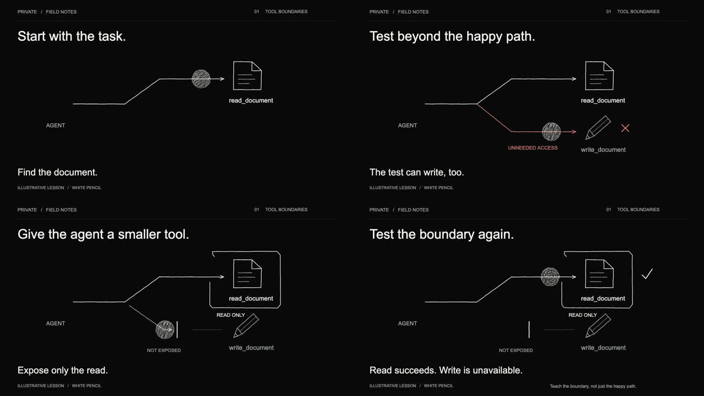

# PRIVATE / White Pencil

An 18-second learning animation and reusable dark variant of Graphite Motion.

[Editable Draw project](https://draw.createsomething.agency/animate?project=1c7e602f-3c45-45f2-ba3f-77f450b20097) · [Style reference](white-pencil-style.md) · [Verification](verification.md) · [Linear CRE-2037](https://linear.app/createsomething/issue/CRE-2037)



- `private-white-pencil.mp4`: H.264, 1280×720, 24 fps; 18-second silent study.
- `private-white-pencil.draw.json`: self-contained editable project with embedded artwork. Import using Draw Motion's Open project control.
- `index.html`, `frame-1.png` through `frame-4.png`, and `captions.vtt`: review page, static storyboard and captions.
- `build.py`: editable story, geometry and keyframes; shared scene timing also generates captions and `scene-times.json`. Python 3 with Pillow reads the sprite dimensions without modifying it.
- `assets/white-pencil-circle-3-frame.png`: transparent sprite with three registered redraws at 8 fps.
- `generation-prompt.md` and `asset-check.json`: source provenance and alpha-registration measurements.

## Review locally

From the repository root:

```sh
node docs/examples/draw-storytelling/private-white-pencil/serve.mjs
```

Open http://127.0.0.1:8779. The loopback-only server supports byte ranges for video seeking. If the existing study server is already running, use that URL directly. No autoplay; reduced-motion users get the static storyboard first.

## Regenerate

Install Python 3 with Pillow and ffmpeg, then run from the repository root:

```sh
pnpm bootstrap:worktree
./docs/examples/draw-storytelling/private-white-pencil/render.sh
```

The script uses the repository's existing Draw/Remotion renderer, then regenerates all four stills, the storyboard, and media metadata from the new video. Captions are rebuilt from the same scene definitions as the animation. The original verified export used renderer source `0155ed2b4cb137548f11e90354242f4e3fe90fe1`; current regeneration follows the checked-out renderer. The source project is portable without local rendering dependencies.

The reusable plugin lives in [packages/graphite-motion-plugin](../../../../packages/graphite-motion-plugin/README.md). Its original warm-paper mode and sprite remain intact. This is a creative study; it does not modify or deploy the PRIVATE application.
