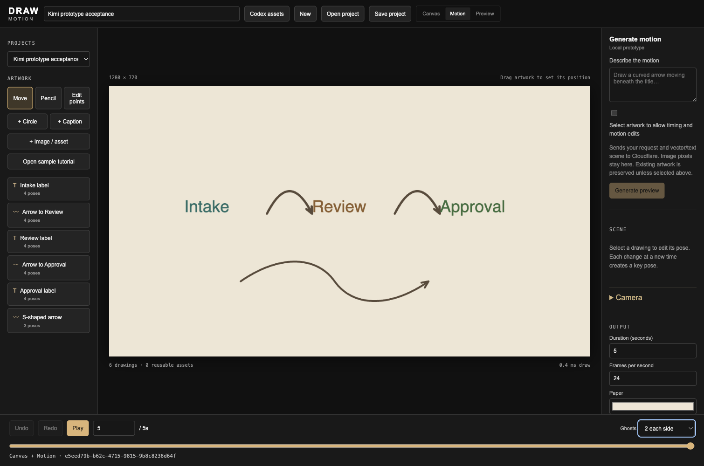

# Local motion generation prototype

The local Motion editor can ask Kimi K2.7 Code for an editable proposal. Describe a scene, review its playback, then explicitly apply it as one undoable change. Generation does not modify the saved project. Discard closes the preview; a changed project invalidates it. Selected artwork can opt into pose-track edits; every other drawing and all project settings are preserved.

This is a local prototype, not a public paid endpoint or an Even glasses app. The controls are omitted from production builds, and the endpoint rejects production and non-loopback hosts before inference. Server credentials never enter the browser. Do not expose the development server through a tunnel or bind it to a public interface.

## Run

After `pnpm bootstrap:worktree`, supply `DRAW_CF_ACCOUNT_ID` and `DRAW_KIMI_API_TOKEN` through the shell or a secret manager. The token needs Workers AI access to that account. These values are deliberately not committed. Then run:

```bash
pnpm --filter @create-something/mapping-canvas dev --host 127.0.0.1 --port 5183
```

Open `http://127.0.0.1:5183/animate`. A missing configuration is shown in the Generate motion panel. Existing Wrangler OAuth can be used for a development session, but expires; a failed request never retries automatically. No changes to an Infisical token, subscription or production deployment are required by this feature.

The request sends the prompt and vector/text scene context to Cloudflare. Image pixels and image drawings are excluded from the provider context and cannot be selected for generated edits; local image layers remain in the preview and saved project. The model therefore cannot reason about their content or avoid every overlap with them.

## Intent and compilation

`draw.motion-intent.v1` contains `summary`, `additions` and `edits`. Additions have a name, six-digit color, weight, geometry and pose keys. Supported geometry is text, arbitrary polylines, and cubic Bézier paths. A curve can request a tangent-aligned arrowhead. Each cubic segment becomes 64 editable subdivisions. This is a general geometry representation, not a catalog of motion presets. Polyline pose points support matching-vertex morphs.

New pose keys inherit omitted properties from the previous key, beginning with the standard base pose. Tracks start at zero and strictly increase. Editing an existing drawing requires its ID in the explicit editable selection and a complete replacement pose track; omitted points on edited keys use the base geometry, matching the canonical animation model. All other drawing properties remain unchanged.

Both server and browser compile the intent. Canonical validation runs before any mutation. Additional checks reject outgoing hold keys that would jump, out-of-frame motion, unexpected fields, unselected edits and duplicate edits. Bounds are conservative over geometry, rotation, scale, translation and existing camera extents, so some valid tight camera compositions are rejected. This is intentional rejection, not automatic geometry repair. Layout overlap, taste, readable contrast and semantic adherence still require preview review.

Limits: 3,000 prompt characters, 500 KB request body, 300 KB provider response, 80 vector/text context drawings, 30-second scenes, 20 additions, 20 selected edits, 32 poses per generated track, eight cubic segments and canonical drawing limits. One request can run at a time per local server process. Timeout is 120 seconds. Cancellation aborts the client request and prevents late application; provider billing after cancellation is not guaranteed to stop.

## Verification

```bash
pnpm --filter @create-something/mapping-canvas test
pnpm --filter @create-something/mapping-canvas check
pnpm --filter @create-something/mapping-canvas build
```

Run build/check before browser inference: development hot reload can discard transient previews. Verify the real app with live inference, not only mocked provider tests. Check generated curve shape and timing, original project unchanged before Apply, Discard, selected-edit preservation, stale revision rejection, one-step Undo and reload persistence. Include a failure case; an invalid response must leave the scene unchanged.

The prototype uses one generator. Jev routing, speech recognition, Even SDK pairing, hardware acceptance, production authentication, distributed quotas and unattended quality assurance are not implemented here. The preceding CRE-2071 comparison supports Kimi as an interactive candidate, not a guarantee of first-pass correctness.

## Observed acceptance, 23 September 2026

Verified in the local Svelte development app with real `@cf/moonshotai/kimi-k2.7-code` inference and Ego Chromium. The editable [accepted sample](examples/kimi-motion-prototype.json) opens through Motion → Open project. It contains six drawings, including 68-point connecting arrows and a 132-point custom S-curve, in a five-second scene.



| Live request | Observed result |
| --- | --- |
| Original Intake → Review → Approval composition, first attempt | Rejected with HTTP 422 for unsupported geometry fields; blank source project unchanged. Added an exact text schema example to the prompt; kept validation strict. |
| Same composition after prompt clarification | Accepted in 38.9 seconds; five editable drawings, rendered preview and playback inspected. |
| Broad fade edit of Intake, preserving its existing movement | Returned a valid proposal in 13.4 seconds but flattened the movement. Rejected during human/agent preview review and discarded. Schema validity does not prove semantic adherence. |
| Precise timing edit, key 0.8 → 1.2 seconds | Accepted in 9.0 seconds; exact key change verified against original poses; all other values and four other drawings unchanged. |
| Custom two-segment S-curve addition | Accepted in 17.7 seconds; smooth rendered curve inspected, all five existing drawings unchanged after Apply. |

Browser checks passed: original scene unchanged before Apply, one-step Undo/Redo, reload persistence, Escape/Discard, changed-revision preview disables Apply, generation cancellation leaves scene unchanged, and a 390 × 844 review modal without horizontal overflow. The original composition was inspected at 0, 1.5, 3 and 4.9 seconds; playback advanced while the source still had zero drawings. The final six-drawing project persisted after reload and exported through Save project. That exact sample imported successfully into the production-built editor.

Final package checks: 298 tests across 25 files, Svelte check with zero errors/warnings, and production build. Focused tests include selected-edit preservation, geometry/timing rejection, morph keys returning to base geometry, provider cancellation, incomplete/wrong-model output, request limits, concurrency and local/production boundaries. The actual built server returned `available: false` and HTTP 404 for generation; its browser UI omitted generation controls.

This small acceptance run establishes working interactions, not a reliability benchmark. Keep preview review: the model can return a structurally valid result that changes more motion than requested. Production, hardware and speech acceptance remain outside this prototype.
