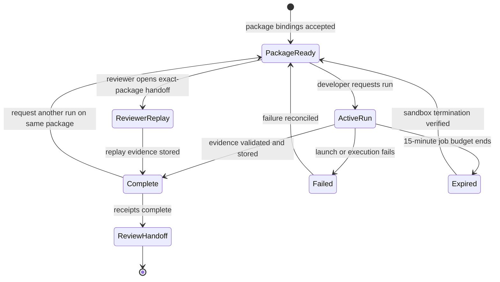

# App Review Preflight Operator Runbook

Use this runbook to operate the production-runtime evidence loop for a Webflow App review. The loop succeeds when independent actors can replay the same immutable test package and receive server-owned evidence. It does **not** approve or reject an app.

## The 60-second rule

Before taking an action, identify four values:

1. **Package:** the Runtime Test Package ID and bundle SHA-256.
2. **Actor:** developer, reviewer, or Webflow runtime coordinator.
3. **State:** package state, observation state, and sandbox termination state.
4. **Next move:** the one action allowed by the decision table below.

If any value is unknown, stop and inspect. Do not create another package or run to make an unclear state disappear.

## The game being played

The developer knows what the app is intended to do. Webflow controls the observation environment. The reviewer decides how the evidence affects review outside this system. These roles stay separate because the actor who benefits from a pass must not control the evidence that earns it.

| Actor               | Goal                                                           | Allowed move                                                                | Cannot do                                                                           |
| ------------------- | -------------------------------------------------------------- | --------------------------------------------------------------------------- | ----------------------------------------------------------------------------------- |
| Developer           | Prove the submitted bundle behaves as declared                 | Upload a bundle, prepare a package, request a run, read evidence            | Upload observed evidence, see the runner capability, inspect another owner's review |
| Reviewer            | Test whether the same evidence can be reproduced independently | Inspect history and replay the exact package                                | Change package bindings, turn evidence into an approval, submit runner evidence     |
| Runtime coordinator | Preserve bindings and start one isolated run                   | Issue a one-time job, create E2B, accept validated artifacts, terminate E2B | Relax a predicate, accept developer evidence, make a review decision                |
| Operator            | Keep the evidence loop safe and legible                        | Inspect state, follow the decision table, record receipts, escalate         | Edit evidence, bypass identity, retry across an unresolved sandbox                  |

### Loss ordering

The system intentionally prefers a visible block to a false pass.

| Outcome                                               | Operational value | Response                                                                      |
| ----------------------------------------------------- | ----------------: | ----------------------------------------------------------------------------- |
| Honest pass reproduced by developer and reviewer runs |           Highest | Preserve the receipts and hand evidence to review                             |
| Honest block with an exact predicate                  |            Useful | Fix the app or package input, then prepare a new package when bindings change |
| Infrastructure failure                                |        Incomplete | Repair the execution path; do not interpret it as app evidence                |
| False pass or partner-manufactured evidence           |      Unacceptable | Fail closed and escalate                                                      |

This loss ordering is the core game-theory rule. A developer gains nothing by manipulating local output because local output cannot become `webflow_observed`. A reviewer gains confidence by replaying the unchanged package. The stable strategy for every actor is therefore to preserve the package and improve the quality of observation.

## What counts as a win

For the production pilot, collect all of the following:

- two completed developer-requested jobs for the same Runtime Test Package ID
- one completed reviewer replay for that exact package
- the same review-version ID and bundle SHA-256 across all three jobs
- `webflow_observed` trust on each completed observation
- immutable artifact count and SHA-256 receipts for each job
- a recorded security result of `passed` or `blocked`
- a recorded negative proxy outcome
- `verified` sandbox termination for every sandbox that started

A security result of `blocked` can still complete the operational loop. It is valid evidence that the app did not satisfy a runtime predicate. Only the external review process can decide what that evidence means for the app.

## State machine



There is no transition from this state machine to official approval. That boundary is deliberate.

## Decision table

Read the three state columns together. The most restrictive state controls the next move.

| Package state          | Latest observation                    | Sandbox termination       | Meaning                                                                | Operator move                                                           |
| ---------------------- | ------------------------------------- | ------------------------- | ---------------------------------------------------------------------- | ----------------------------------------------------------------------- |
| `ready`                | none                                  | not started               | Inputs are bound; no browser has run                                   | Start the first developer run                                           |
| `ready`                | `approved`, `running`, or `uploading` | `pending`                 | One active job owns the package                                        | Wait, then select **Check run status**                                  |
| `ready`                | `complete` + `webflow_observed`       | `verified`                | Evidence is immutable and the sandbox is gone                          | Record the receipt; rerun the same package or begin reviewer replay     |
| `ready`                | `complete` + `webflow_observed`       | `failed` or `pending`     | Evidence exists, but cleanup is unresolved                             | Stop; reconcile termination before another run                          |
| `ready`                | `failed`                              | not started               | Configuration or sandbox creation failed before a sandbox was retained | Repair infrastructure; retry the same package                           |
| `ready`                | `failed`                              | `verified`                | A sandbox started, failed, and was removed                             | Record the failure stage; retry the same package after repair           |
| `ready`                | `failed`                              | `failed` or `pending`     | A failed job may still own a sandbox                                   | Stop; reconcile termination before retrying                             |
| `ready`                | `expired` or `revoked`                | `verified` or not started | The job is terminal and no sandbox remains                             | Request a fresh run if the package license is still valid               |
| `expired` or `revoked` | any                                   | any                       | The package cannot authorize another job                               | Prepare a new package after all prior sandboxes are verified terminated |

Two rapid requests for the same package are deduplicated to the one active job. Never treat a deduplicated response as a second run.

## Normal operating sequence

### 1. Establish the immutable checkpoint

In the Designer Extension:

1. Confirm the uploaded zip is the exact submission bundle.
2. Record the review-version ID and bundle SHA-256.
3. Confirm the deterministic bundle review has no unexplained result.
4. Prepare one Runtime Test Package with the dedicated published test site.
5. Record the Runtime Test Package ID.

The package must bind:

- published Webflow test URL and host
- Webflow installation or site ID
- current review-version ID and bundle SHA-256
- immutable runtime URL
- runtime SHA-256 and matching SRI
- runtime-ready selector
- bounded negative proxy probe
- installation allowlist expiring within 24 hours

If any binding changes, prepare a new package. Do not compare a new package as if it were another run of the old one.

### 2. Run the developer check twice

1. Select **Run test now**.
2. Wait for a terminal observation state.
3. Select **Check run status** until the state is terminal.
4. Record the first job receipt.
5. Confirm sandbox termination is `verified`.
6. Select **Run test again** without preparing another package.
7. Record the second job receipt.
8. Confirm sandbox termination is `verified`.

The two job IDs must differ. The Runtime Test Package ID, review-version ID, and bundle SHA-256 must match.

### 3. Run the independent reviewer replay

1. Sign in with a configured reviewer identity.
2. Select **Create reviewer workspace**.
3. Open the one-time handoff.
4. Compare the package bindings and previous observation history.
5. Request the replay from the reviewer workspace.
6. Refresh until the new job is terminal.
7. Record the reviewer job receipt.
8. Confirm sandbox termination is `verified`.

The reviewer replay must create a new job. It must not overwrite either developer observation.

### 4. Hand evidence to review

Attach the three receipts and state one conclusion:

- **reproduced pass:** all three observations passed the runtime predicates
- **reproduced block:** all three observations reported the same blocker
- **mixed evidence:** observations disagree; manual investigation is required
- **infrastructure incomplete:** one or more runs did not produce trusted evidence

Never write “approved by Preflight.” Preflight produces evidence only.

## Read the result correctly

### Security result

`passed` means all required runtime predicates passed in that observation. `blocked` means at least one predicate did not.

Inspect these predicates separately:

- published target reached
- runtime-ready selector observed
- runtime loaded by the page
- executed runtime SHA-256 matched the pin
- DOM integrity matched the SRI pin
- no runtime-created script elements appeared
- no unreviewed runtime scripts appeared
- negative proxy canary was blocked

Do not collapse a failed predicate into “the sandbox failed.” Predicate failures are app evidence; launch, upload, and termination failures are infrastructure evidence.

### Negative proxy result

- `blocked`: the expected safe result
- `exposed`: a security blocker
- `error`: inconclusive; investigate before interpreting the run

### Cleanup result

Cleanup is recorded for context but is not scored for the current Consent Pro pilot. `residue_detected` still belongs in the receipt so a reviewer can judge it separately.

## Failure routing

Debug in Database, Automation, Judgment order.

### Database: are the bindings and states true?

Confirm the review version, package, latest job, actor, expiry, and sandbox lifecycle in D1. Use the production deployment's D1 binding; never copy credentials into the runbook or receipt.

```sql
SELECT
  j.id AS observation_job_id,
  j.test_package_id,
  j.status,
  j.evidence_trust,
  j.approved_by_actor,
  j.approved_at,
  j.consumed_at,
  j.expires_at,
  j.sandbox_id,
  j.sandbox_started_at,
  j.sandbox_termination_status,
  j.sandbox_terminated_at
FROM runtime_observation_jobs AS j
WHERE j.test_package_id = '<runtime-test-package-id>'
ORDER BY j.created_at ASC;
```

Stop if an active job exists in `approved`, `running`, or `uploading`. Only one active job is allowed per package.

### Automation: did the execution path finish?

Classify the failure before retrying:

| Failure class                    | Evidence                                                   | Safe response                                                                 |
| -------------------------------- | ---------------------------------------------------------- | ----------------------------------------------------------------------------- |
| `configuration`                  | Runner not configured                                      | Restore reviewed server configuration; keep the package                       |
| `sandbox_create`                 | E2B could not create or validate a sandbox                 | Check E2B service, template reference, and launch response; keep the package  |
| `runner_start`                   | Sandbox exists but the baked runner did not accept the job | Check immutable template health and restricted traffic; verify termination    |
| execution or evidence validation | Job started but no trusted result completed                | Inspect sanitized Worker/E2B logs and contract validation; verify termination |
| artifact upload                  | Job reached `uploading` but storage did not complete       | Check R2 and manifest validation; do not construct evidence manually          |
| termination                      | Sandbox termination is not `verified`                      | Stop new runs and reconcile the sandbox                                       |

The scheduled Worker handler expires stale active jobs and retries unresolved sandbox termination. A manual retry is safe only after the lifecycle row proves that no prior sandbox remains.

### Judgment: what does the evidence mean?

Apply the review policy only after Database and Automation are coherent. A runtime block is not an infrastructure failure, and a successful infrastructure run is not an app approval.

Escalate when:

- developer runs disagree on the same immutable package
- the reviewer replay differs from both developer runs
- executed bytes match SHA-256 but DOM SRI does not match
- a runtime-created or unreviewed child script appears
- the proxy canary is exposed or inconclusive
- sandbox termination remains unresolved
- identity or ownership does not match the package

## Anti-cheating invariants

These invariants make honest participation the rational strategy:

- Partner-supplied settings remain `partner_supplied`; they cannot become evidence by themselves.
- Only the server creates the one-time runner capability, and only the named E2B sandbox receives it.
- The developer and reviewer interfaces cannot upload `webflow_observed` evidence.
- The Worker validates contract bindings, artifact types, byte limits, and SHA-256 before persistence.
- A completed evidence upload consumes the capability; replaying it fails closed.
- One active observation job is allowed per package.
- Reviewer access is role-specific, one-time, package-bound, and cross-owner only by explicit authorization.
- Every started sandbox must reach `verified` termination before another safe run.
- Legacy runtime mutation endpoints return `410` and cannot re-enter the evidence path.
- The job contract sets `officialDecision` to `null` and forbids governance writes.

If an operational shortcut weakens one of these invariants, do not take it.

## Operator receipt

Copy this block for each run:

```text
review_id:
review_version_id:
bundle_sha256:
runtime_test_package_id:
actor_role: developer | reviewer
observation_job_id:
observation_status:
evidence_trust:
security_status:
security_blockers:
negative_proxy_outcome:
artifact_count:
artifact_sha256s:
sandbox_id:
sandbox_termination_status:
approved_at:
completed_at:
operator:
notes:
```

For the three-run pilot receipt, add:

```text
same_package_across_runs: true | false
developer_job_ids:
reviewer_replay_job_id:
all_sandboxes_terminated: true | false
result: reproduced_pass | reproduced_block | mixed_evidence | infrastructure_incomplete
official_decision: null
```

## Stop conditions

Stop the loop immediately when:

- the package, review version, or bundle SHA cannot be proven
- the actor role is wrong or ambiguous
- another active job exists
- a prior sandbox is not verified terminated
- a package or job is expired and the UI has not refreshed
- a reviewer handoff opens a different package
- anyone asks to upload, edit, or relabel observed evidence
- anyone describes the Preflight result as an official decision

Preserve the current state, record the IDs, and escalate. Do not generate new state to hide the old state.

## Performance content lint

Future edits to this runbook pass only when a cold reader can answer each question without reading source code:

- What is the operational objective?
- Which actor am I?
- Which identifiers must remain unchanged?
- What state is the package, job, and sandbox in?
- What is the one safe next move?
- What evidence must I record?
- When must I stop?
- Which results are app evidence, infrastructure evidence, or external judgment?

Apply these editorial rules:

- Put the outcome before background.
- Use the exact UI labels and stored status values.
- Give each numbered step one action.
- Pair every failure with a safe response.
- Keep secrets out; name environment variables or bindings instead.
- Use “evidence,” never “approval,” for Preflight output.
- Remove any sentence that does not change an operator decision.
