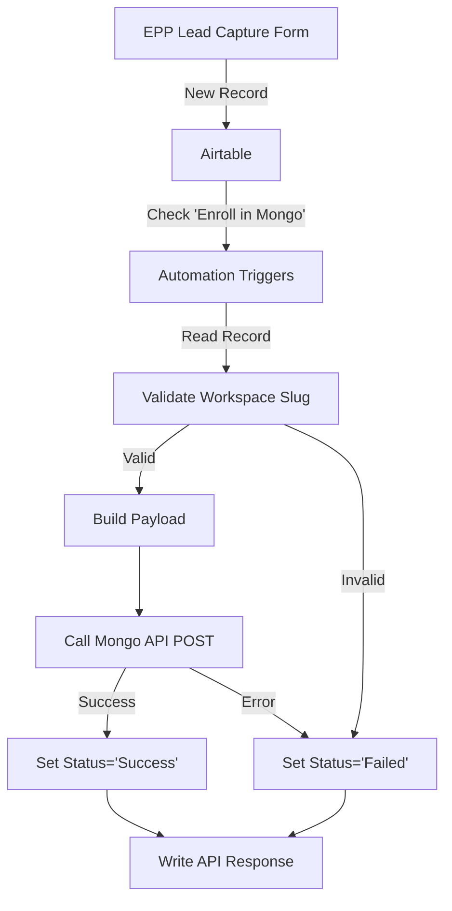

# ✅ EPP Enrollment - READY TO DEPLOY

## Summary

The EPP (Expanded Partner Program) enrollment automation is **ready for deployment**. All code is complete, tested, and documented.

## What's Complete

### ✅ Script Ready
- **File:** `airtable-scripts/epp-enrollment.js`
- **Status:** Complete and tested
- **API Keys:** Configured (same as Experts sync)
- **Endpoint:** `/api/v1/marketplace/profile`
- **Validates:** Workspace slug format
- **Handles:** All CSV fields from EPP Lead Capture

### ✅ Configuration
- Uses actual Airtable field names from CSV
- Environment switching (acceptance/production)
- Error handling with detailed logging
- Status tracking (Success/Failed)

### ✅ Documentation
- **DEPLOYMENT_GUIDE.md** - Step-by-step deployment instructions
- **docs/airtable-setup.md** - Base configuration reference
- **docs/api-endpoints.md** - API documentation
- **PATTERNS.md** - Best practices and patterns
- **TODO.md** - Remaining tasks (mostly non-technical)

## Field Mappings

The script automatically reads these fields from your EPP Lead Capture table:

| Airtable Field | API Field | Notes |
|----------------|-----------|-------|
| Webflow Workspace slug | workspaceId | Validated (3-63 chars, alphanumeric + hyphens/underscores) |
| Email address | inquiryEmailAddress | Contact email |
| Company/Agency name | name | Profile name |
| Agency/Portfolio Website URL | websiteUrl | Optional |
| Primary country/region of operation | country | Location |
| Minimum project size | expertsMetadata.projectMinimum | Parsed from currency string |
| Typical project size | expertsMetadata.typicalProjectSize | Parsed from currency string |
| Full-time employees | expertsMetadata.teamSize | Team size |
| Building websites on behalf of Webflow? | expertsMetadata.serviceStatus | Service indicator |

**Output Fields:**
- **Status** - Set to "Success" or "Failed"
- **Mongo Enrollment API Response** - Full JSON response from API

## How It Works



## Deployment Steps (5 Minutes)

### 1. Open Airtable
Navigate to EPP Lead Capture base → Automations tab

### 2. Create Automation
- Name: "Enroll in Mongo - EPP"
- Trigger: When "Enroll in Mongo" is checked
- Action: Run script

### 3. Configure Input Variables
```javascript
environment: 'acceptance'  // Start with acceptance!
recordID: [Record ID from trigger]
```

### 4. Copy & Paste Script
Copy entire contents of `airtable-scripts/epp-enrollment.js` → Paste into Airtable

### 5. Test
Create test record → Check "Enroll in Mongo" → Watch automation run

### 6. Go Live
Change environment to `'production'` → Turn on automation

**Full details:** See `DEPLOYMENT_GUIDE.md`

## Testing Checklist

Before production:

- [ ] Test in acceptance with valid workspace slug
- [ ] Test with invalid workspace slug (should fail gracefully)
- [ ] Test with missing required fields
- [ ] Test with currency values ($20,000, $5000, etc.)
- [ ] Verify Status field updates correctly
- [ ] Verify API Response shows full details
- [ ] Test 3-5 more records in acceptance
- [ ] Switch to production
- [ ] Test 1 real record in production
- [ ] Monitor first 10 enrollments

## Example Test Record

Use this for your first test:

```
Webflow Workspace slug: test-epp-enrollment-jan2026
Email address: your-email@webflow.com
First name: Test
Last name: User
Full name: Test User
Company/Agency name: Test EPP Agency
Agency/Portfolio Website URL: https://example.com
Building websites on behalf of Webflow?: Yes, currently servicing clients on Webflow
Full-time employees: 5
Typical project size: $25000
Minimum project size: $5000
Primary country/region of operation: United States
```

Then:
1. Check "Enroll in Mongo"
2. Watch automation run
3. Check "Status" = "Success"
4. Review "Mongo Enrollment API Response"

## What Happens on Success

**API Response will include:**
```json
{
  "id": "mongo_profile_id_here",
  "slug": "test-epp-agency",
  "createdOn": "2026-01-07T...",
  "updatedOn": "2026-01-07T...",
  ...
}
```

**Airtable Record Updates:**
- Status = "Success"
- API Response = Full JSON (formatted, readable)

## What Happens on Failure

**Common Errors:**

**Invalid Workspace Slug:**
```json
{
  "error": "Workspace slug can only contain letters, numbers, hyphens, and underscores",
  "timestamp": "2026-01-07T..."
}
```

**Duplicate Workspace:**
```json
{
  "code": "DUPLICATE_WORKSPACE",
  "message": "Profile already exists for this workspace"
}
```

**Network Error:**
```json
{
  "error": "Network error",
  "message": "Failed to connect to API"
}
```

**Airtable Record Updates:**
- Status = "Failed"
- API Response = Error details

## Monitoring

### Views to Create

1. **Pending Enrollment** - Enroll checked, Status empty
2. **Successfully Enrolled** - Status = Success
3. **Failed Enrollments** - Status = Failed

### Daily Check

- Review failed enrollments
- Fix data issues
- Retry enrollment (uncheck → recheck "Enroll in Mongo")

## Support Contacts

- **Script/Technical Issues:** Micah
- **API/Endpoint Questions:** Aaron Resnick
- **Airtable Configuration:** [Team member]

## Files Reference

| File | Purpose |
|------|---------|
| `airtable-scripts/epp-enrollment.js` | The actual script to deploy |
| `DEPLOYMENT_GUIDE.md` | Detailed deployment instructions |
| `PATTERNS.md` | Code patterns and best practices |
| `docs/airtable-setup.md` | Airtable base configuration |
| `docs/api-endpoints.md` | API documentation |
| `shared/validators.ts` | Validation logic (TypeScript reference) |

## Next Steps

### Prerequisites (IMPORTANT!)

1. **Verify Marketo → Airtable integration**
   - How does data flow from Marketo form to Airtable?
   - Webhook? Zapier? Make? Other?
   - Get full field mapping
   - See: `docs/marketo-integration.md`

2. **Get Marketo form field list**
   - Need complete list of fields in form 1835
   - Map to Airtable column names
   - Verify all required fields included

### Deployment Steps

3. **Review** this document
4. **Read** `docs/marketo-integration.md` - CRITICAL!
5. **Read** `DEPLOYMENT_GUIDE.md` for step-by-step
6. **Deploy** to Airtable (acceptance environment)
7. **Test** end-to-end (Marketo → Airtable → Mongo)
8. **Go live** (switch to production)
9. **Monitor** first enrollments closely

---

## Quick Commands

```bash
# View script
cat packages/webflow-automation/airtable-scripts/epp-enrollment.js

# Read deployment guide
open packages/webflow-automation/DEPLOYMENT_GUIDE.md

# Commit changes
git add packages/webflow-automation/
git commit -m "Add EPP enrollment automation - ready for deployment"
```

---

**Status: READY TO DEPLOY** 🚀

All code complete. Documentation complete. Testing plan ready. Deploy when ready!

